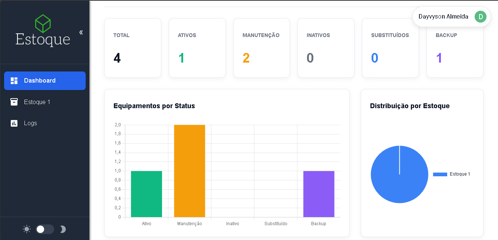
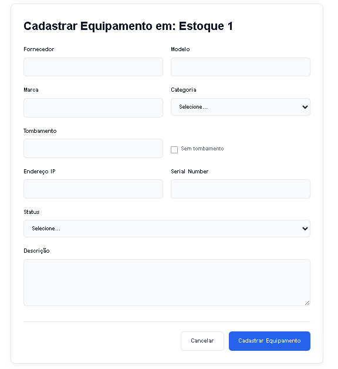
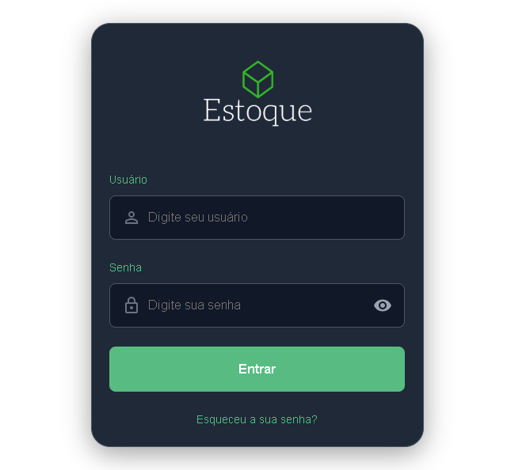

# Apresentação do Projeto — Controle Estoque

Este documento reúne imagens e textos prontos para apresentar o projeto no GitHub, LinkedIn ou em slides.

## Banner

---

## Capturas de tela (do diretório `docs/assets`)

1) Dashboard

2) Formulário de Equipamento

3) Login

---

## Texto sugerido para GitHub / LinkedIn

Breve (para README ou post):

> Controle Estoque — aplicação web para gerenciar equipamentos, estoques e históricos. Backend em Django REST Framework, frontend em React e autenticação por JWT. Ideal para equipes de TI que precisam inventariar e acompanhar movimentações de ativos.

Texto mais longo (parágrafo para um post no LinkedIn):

> Apresentei meu projeto "Controle Estoque": um sistema completo para gerenciar equipamentos, estoques e logs de movimentação. Desenvolvido com Django REST Framework no backend e React no frontend, o projeto implementa autenticação via JWT, controle de permissões por grupos, histórico de alterações e filtros avançados na listagem de equipamentos. Veja o repositório para instruções de instalação, API e exemplos.

---

## Publicar como página no GitHub

- Para servir esta apresentação como página estática, ative **GitHub Pages** nas configurações do repositório e aponte para a pasta `docs/`. O arquivo `docs/presentation.md` será exposto como página.
- Alternativamente, compartilhe diretamente o link para este arquivo no repositório.

---

## Notas

- Os arquivos de imagem usados estão em `docs/assets/`.
- Se quiser, posso gerar versões otimizadas (PNG) para LinkedIn ou converter para outros formatos.

***
# Apresentação do Projeto — Controle Estoque

Este documento serve como material visual para apresentar o projeto em GitHub, LinkedIn ou apresentações rápidas.

## Banner

## Capturas de tela (substitua pelas reais)

1) Dashboard

2) Formulário de Equipamento

3) Login

## Texto sugerido para GitHub / LinkedIn

Breve (para README ou post):

> Controle Estoque — aplicação web para gerenciar equipamentos, estoques e históricos. Backend em Django REST Framework, frontend em React e autenticação por JWT. Ideal para equipes de TI que precisam inventariar e acompanhar movimentações de ativos.

Texto mais longo (parágrafo para um post no LinkedIn):

> Apresentei meu projeto "Controle Estoque": um sistema completo para gerenciar equipamentos, estoques e logs de movimentação. Desenvolvido com Django REST Framework no backend e React no frontend, o projeto implementa autenticação via JWT, controle de permissões por grupos, histórico de alterações e filtros avançados na listagem de equipamentos. Veja o repositório para instruções de instalação, API e exemplos.

## Como substituir as imagens

- Substitua os arquivos `docs/assets/screenshot-*.svg` pelas capturas reais (PNG/JPG) mantendo o mesmo nome, ou atualize os caminhos no arquivo `docs/presentation.md`.
- Para exportar SVG como PNG localmente, você pode usar ferramentas de design (Figma, Inkscape) ou um comando como `magick` (ImageMagick) quando disponível.

## Uso rápido

- Recomendação para GitHub: coloque o banner `./docs/assets/banner.svg` no topo do `README.md` (já aplicado), e inclua o link para `docs/presentation.md` como material de apresentação.

---

Se quiser, eu posso:
- Exportar esses SVGs como PNG (se você autorizar eu gerar arquivos PNG aqui) — ou
- Gerar uma imagem de capa em tamanho otimizado para LinkedIn (1584×396 px) pronta para upload.
